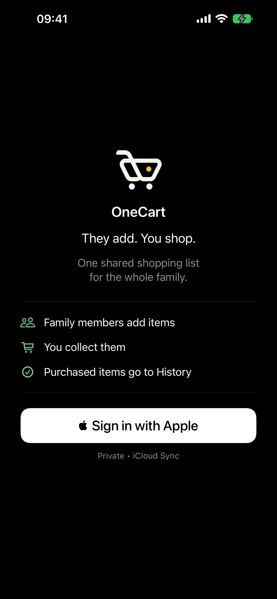
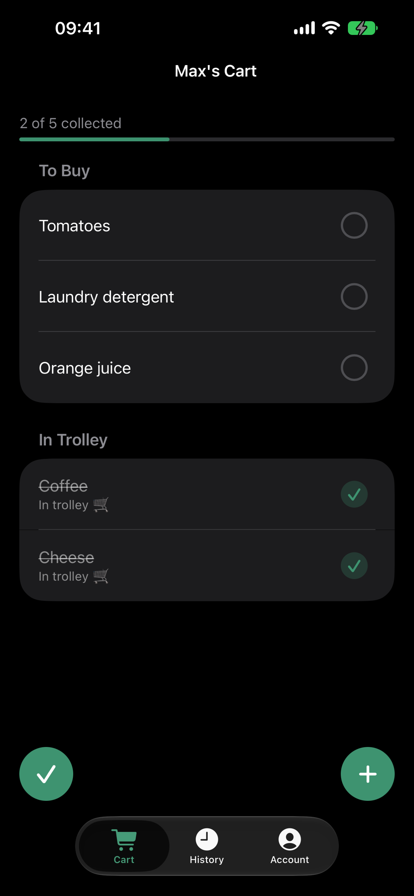
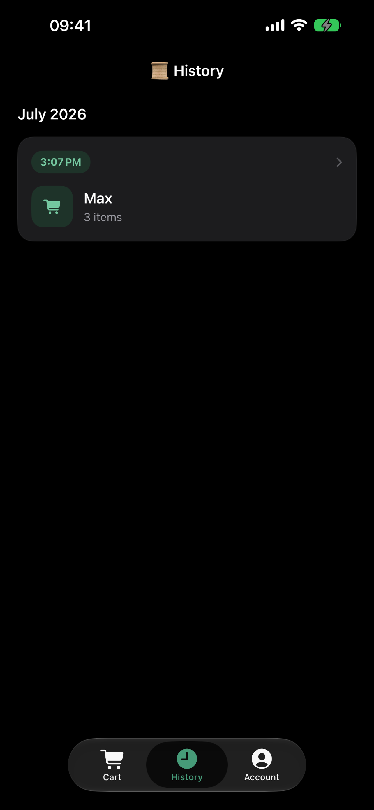
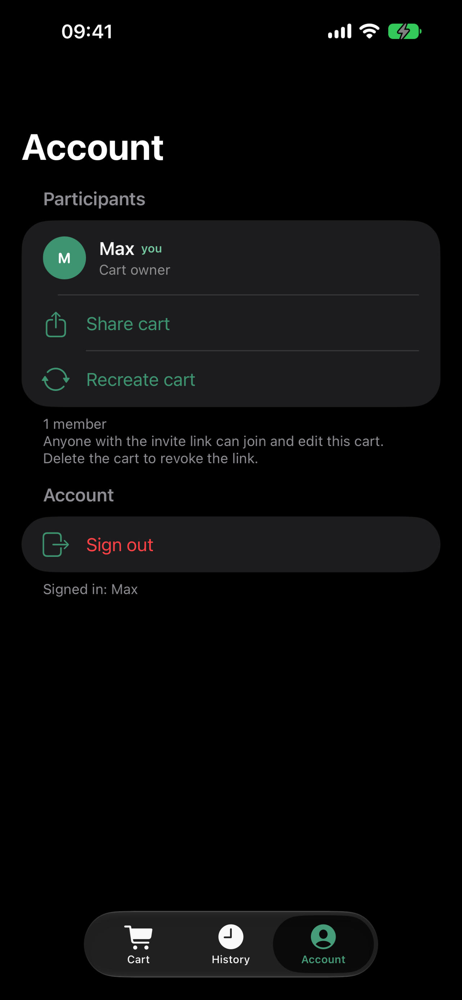

# OneCart

One shared family cart on iOS: add what you need, mark what is already in the trolley at the store, and keep purchase sessions in one place. Sign in with Apple; sync and invites run through iCloud / CloudKit (`CKShare`).

## About this repo

This is a **father–son pet project**: we build and ship a real iOS app together as a way to learn product, SwiftUI, Core Data / CloudKit, and App Store tooling.

Keep that framing **here** (README / contributor docs). Do **not** put “learning project”, “demo for my kid”, classroom, or similar wording in App Store Connect metadata, review notes, screenshots, or in-app marketing copy — describe OneCart as a normal family shopping cart product so Review does not treat the listing as incomplete or non-app content.

## Screenshots

<p>
  
  
  
  
</p>

Store masters and ASC sizes: [`assets/store/`](assets/store/).

## Stack

- SwiftUI, iOS 26+
- Core Data via `NSPersistentCloudKitContainer`
- CloudKit private / shared databases
- `CKShare` link-join invites (`publicPermission = .readWrite`)
- Offline-first local SQLite stores

Bundle ID: `com.vil555tim.onecart`  
CloudKit container: `iCloud.com.vil555tim.onecart`

## Open in Xcode

Open **`OneCart/OneCart.xcodeproj`** (scheme `OneCart`).

For device / TestFlight: App ID capabilities and CloudKit Production — see [docs/release.md](docs/release.md).

## Layout

```text
.
├── OneCart/                 # App product
│   ├── OneCart.xcodeproj
│   ├── Application/         # App entry, AppSession, root + tabs
│   ├── Features/            # Feature UI + ViewModels
│   ├── Data/                # Persistence, CloudKit, Auth
│   ├── Shared/
│   ├── Resources/
│   └── Tests/
├── docs/                    # See docs/README.md
├── assets/                  # Brand / store masters (not in the app bundle)
├── Tooling/                 # Engineering Runtime — see Tooling/README.md
├── justfile                 # Thin shim → import Tooling/justfile
├── README.md
├── AGENTS.md
└── .gitignore
```

Native SwiftUI only — no web / Capacitor stack.

## Commands

```bash
brew bundle --file=Tooling/Brewfile
just doctor
just build
just test
just verify
```

Config: [`Tooling/runtime.yml`](Tooling/runtime.yml). Local overrides: `Tooling/runtime.local.yml.example` → `Tooling/runtime.local.yml`.

## Docs

Start at [docs/README.md](docs/README.md) — architecture, product, release, legacy, review changelog.
