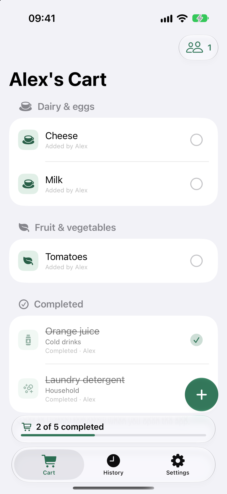
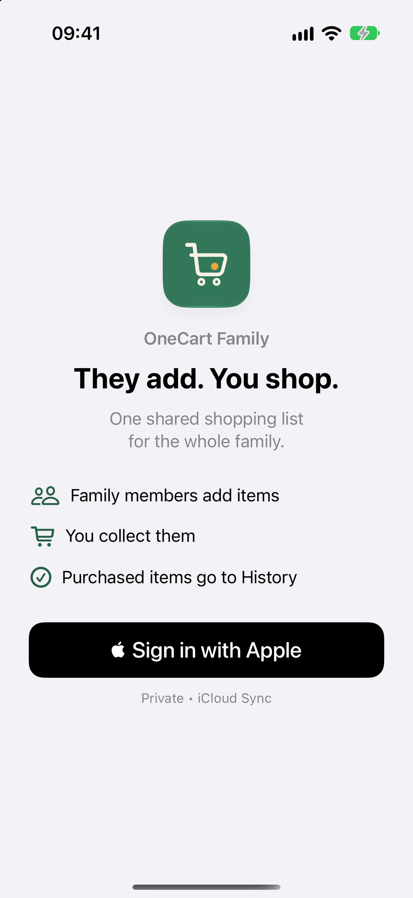
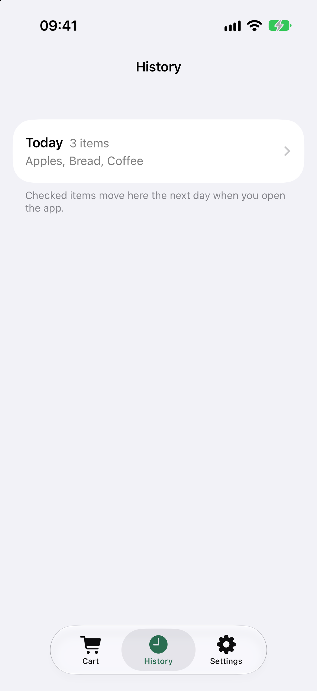
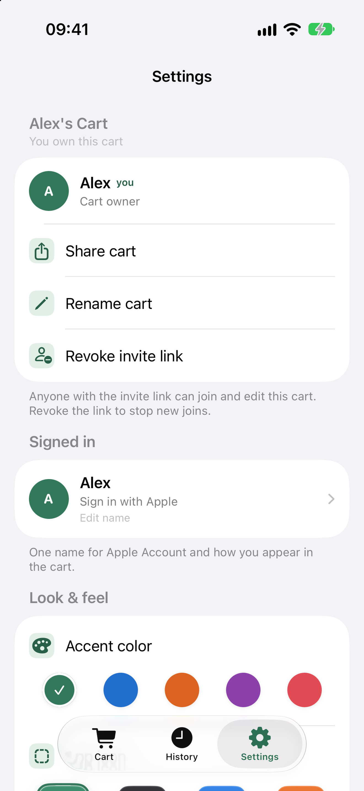

# OneCart Family

One shared shopping cart for the whole family: anyone adds what is needed, the shopper checks
items off in the store, and everyone follows the progress and sees what was bought, day by day.

**Status:** live on the [App Store](https://apps.apple.com/app/id6793219621) as OneCart
Family; version 1.7.0 is in TestFlight.

<p></p>

## How this app is built

- Coding agents work in fixed roles under [AGENTS.md](AGENTS.md): writers implement one card
  each in their own worktree, an integrator lands the work, and the owner directs product and
  architecture. A second developer contributed the Live Activity and Siri features.
- Behavior is specified as numbered requirements (`REQ-AREA-NNN`) that the owner approves:
  [docs/requirements/product.md](docs/requirements/product.md).
- One verification gate, `just verify` (lint, build, unit and UI tests), must pass before any
  change lands.
- A separate reviewer checks every change for defects before it lands; findings and repairs are
  recorded in the [task briefs](docs/tasks/).
- A requirement-to-test matrix proves each approved requirement with named tests
  ([coverage](docs/requirements/product.md#coverage)); design choices live in
  [decision records](docs/decisions/), and every step is in the
  [commit history](https://github.com/vil4max/onecart-ios/commits/main).

**Stack:** Swift 6, SwiftUI, Core Data with CloudKit (private and shared stores, `CKShare`
invites), WidgetKit, Live Activities, App Intents, Foundation Models; iOS 27+, iPhone.

---

## Engineering details

User-facing product name: **OneCart Family**. Repo / Xcode module / scheme stay **OneCart**.

One shared family cart on iOS: add what you need, mark items **Completed** at the store, and see purchases in **History by day** (overnight archive when you open the app). Sign in with Apple; sync and invites run through iCloud / CloudKit (`CKShare`).

OneCart Family is maintained as a real product: Sign in with Apple, offline-first Core Data with CloudKit private and shared stores, `CKShare` invites, WidgetKit and App Intents, and XCTest regression suites for cart state, sharing, persistence, synchronization errors, and deletion recovery.

### Screenshots

<p>
  
  
  
  
</p>

Store masters and ASC sizes: [`assets/store/`](assets/store/).

### Stack

- SwiftUI, iOS 27+
- Core Data via `NSPersistentCloudKitContainer`
- CloudKit private / shared databases
- `CKShare` link-join invites (`publicPermission = .readWrite`)
- Offline-first local SQLite stores

Bundle ID: `com.vil555tim.onecart`  
CloudKit container: `iCloud.com.vil555tim.onecart`

### Open in Xcode

Open **`OneCart/OneCart.xcodeproj`** (scheme `OneCart`).

For device / TestFlight: App ID capabilities and CloudKit Production — see [docs/operations/release.md](docs/operations/release.md).

### Layout

```text
.
├── OneCart/                 # App product
│   ├── OneCart.xcodeproj
│   ├── Application/         # App entry, AppSession, root + tabs
│   ├── Features/            # Feature UI + ViewModels
│   ├── Data/                # Persistence, CloudKit, Auth
│   ├── Shared/
│   ├── Resources/
│   └── Tests/
├── docs/                    # See docs/README.md
├── assets/                  # Brand / store masters (not in the app bundle)
├── Tooling/                 # Engineering Runtime — see Tooling/README.md
├── justfile                 # Thin shim → import Tooling/justfile
├── README.md
├── AGENTS.md
└── .gitignore
```

Native SwiftUI only — no web / Capacitor stack.

### Commands

```bash
brew bundle --file=Tooling/Brewfile
just doctor
just build
just test
just verify
```

Config: [`Tooling/runtime.yml`](Tooling/runtime.yml). Local overrides: `Tooling/runtime.local.yml.example` → `Tooling/runtime.local.yml`.

Install the repository pre-push hook once with `./scripts/install-hooks.sh`.
It runs smoke tests for branch updates and skips tag-only pushes and ref deletions.

### Docs

Start at [docs/README.md](docs/README.md) — architecture, product, release, legacy, review changelog.
