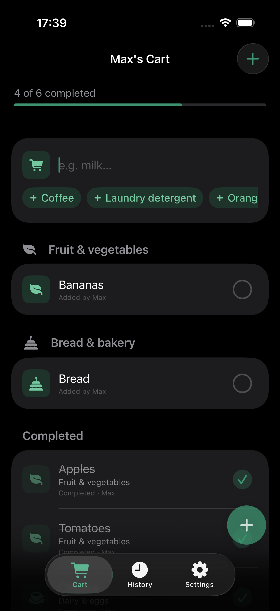
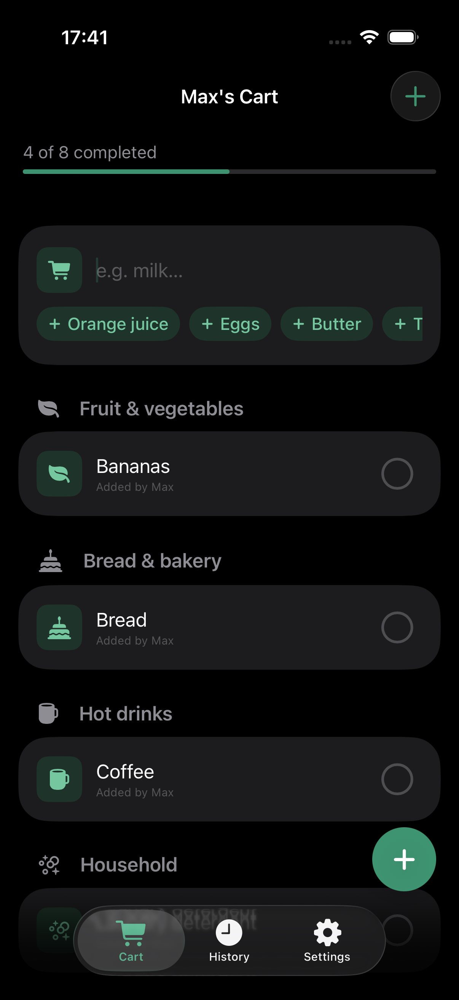
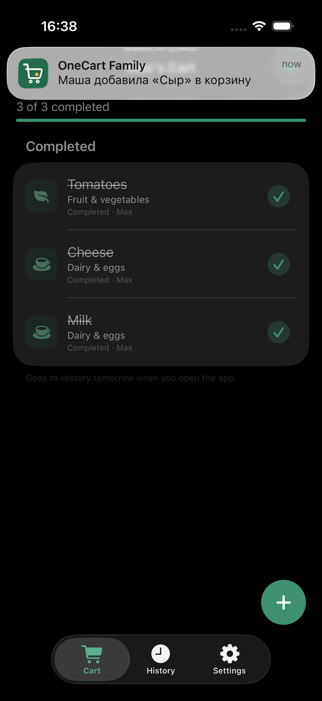

# Release (owner runbook)

Bundle ID `com.vil555tim.onecart` · Team `BTHRDS7254` · Container `iCloud.com.vil555tim.onecart`.

## Preflight (this branch)

Local release candidate: **1.2.1 (1)** for both the app and widget extension.
Marketing versions use `MAJOR.MINOR.PATCH`, with all three components treated as integers. A feature release increments MINOR and resets PATCH to `0`; a fix-only release increments PATCH instead. Do not roll MAJOR without an explicit request.
A new marketing version resets the local build number to **1**; subsequent builds
of that version must use a higher unused number. Confirm the actual uploaded build
number in Xcode Cloud / App Store Connect before selecting it for submission.

Release notes and candidate status: [1.2.1](releases/1.2.1.md) (previous: [1.2](releases/1.2.md)).
Version **1.2 (91)** was confirmed Ready for Distribution in App Store Connect on September 16, 2026.
Version **1.2.1 (105)** was submitted for App Review on September 17, 2026 (tag `v1.2.1`).
App Store Connect version availability, cloud build status, and submission status
must be checked in an authenticated session before publication.

**Scope for this train:** living family cart sync + invite/ACL + owner Revoke invite (durable cart). Home & lock screen widgets, persistent auth across relaunch, appearance preferences, local family activity notifications (build 87), and quick suggestion chips (build 88). Three tabs (Корзина / История / Настройки), name-only add, share from «Настройки»; Stores/catalog UI, price and unit input are out on purpose; see [product.md](../requirements/product.md). Do not block release on restoring those features.

### Build 88 Highlights (Quick Suggestion Chips)
- **1-Tap Add Suggestions:** Frequently purchased items appear directly below the text input inside the composer card when adding an item.
- **Dynamic Frequency Ranking:** Powered by `CartSuggestionsEngine`, ranking suggestions by purchase frequency from historical shopping sessions, automatically excluding items already in the cart.
- **Real-Time Text Filtering:** Suggestions filter as the user types with prefix-match priority.
- **Clean Inset-Grouped Layout:** Integrated into the composer row cell with `.buttonStyle(.borderless)` — no bottom overlay, no floating tab bar collision, and no drag jitter.
- **Screenshots:**
  - 
  - 

### Build 87 Highlights (Smart Family Notifications)
- **Item added by partner:** Local notification when the app observes newly imported items from a family member (*«Маша добавила «Сыр» в корзину»*).
- **All items purchased:** Local celebration notification when the app observes a partner completing the last remaining item (*«Всё куплено! 🎉»*).
- **Anti-spam:** Ignores self-actions, seeds baseline on first install, suppresses single-user carts, aggregates multiple items into one concise banner.
- **Screenshots:**
  - 
  - 

On a Mac with Xcode:

```bash
brew bundle --file=Tooling/Brewfile
just doctor
just verify
```

Or explicitly:

```bash
just build
just test
```

Simulator is enough for UI + unit tests. Real family sync needs two physical devices (below).

## 1. Apple Developer

1. Attach iCloud container `iCloud.com.vil555tim.onecart`.
2. Enable **Sign in with Apple**, **iCloud (CloudKit)**, **Push Notifications**.
3. Recreate Development/Distribution profiles after capabilities.
4. Team in Xcode must match the project Team.
5. Entitlements (`CKSharingSupported`, SIWA, iCloud) are already in the project. Unsigned Debug builds compile without App ID setup; signed install + real sync need the steps above.

## 2. CloudKit Production schema (required for TestFlight and Xcode Run)

TestFlight / App Store talk to CloudKit **Production**. OneCart also pins **Production** in both Debug and Release entitlements (`com.apple.developer.icloud-container-environment = Production`) so Xcode Run mirrors the same schema as TestFlight (Core Data + share keys stay aligned). The shared scheme **Launch** configuration is **Release** for the same reason; **Test** stays **Debug** for `@testable`.

New Core Data entities **and new attributes** are **not** created in Production automatically. Without a deploy you get:

`Cannot create new type CD_ShoppingList in production schema`

or (after model field adds):

`Cannot create or modify field 'CD_deletedAt' in record 'CD_Product' in production schema`

(and the app alert about mirroring / Partial Failure).

**Do this before relying on sync/share:**

1. Open [CloudKit Console](https://icloud.developer.apple.com/) → container `iCloud.com.vil555tim.onecart`.
2. Prefer Environment **Production** → Schema → confirm record types exist (at least):  
   `CD_FamilySpace`, `CD_ShoppingList`, `CD_Product`, `CD_Store`, `CD_PurchaseHistory`, `CD_HistoryItem`  
   and that soft-delete / attribution fields such as `CD_deletedAt`, `CD_createdByName`, and
   `CD_purchasedByName` appear on the types that use them (especially `CD_Product`).
3. If fields are missing: initialize them in **Development** (run once against Development, or add fields), then **Deploy Schema Changes → Production**.
4. Force-quit the app (Xcode or TestFlight), relaunch, retry invite/sync.

Until Production has the fields Core Data expects, sync/share will keep failing even if the binary is fine.

**Agents / CI cannot perform Deploy.** There is no API to promote schema to Production (`cktool` only imports Development). The container admin must click Deploy in CloudKit Console. App builds can only detect the failure and show a clear alert.

## 3. Two-device checklist

Physical devices, different iCloud accounts (simulator is UI/local Core Data only):

1. Signed Debug / TestFlight build on A and B (the candidate version/build under test). Production CloudKit schema deployed (§2).
2. On A: SIWA → empty household cart; add items (including offline). Failures show as a system alert (OK).
3. Go online → items remain; share so both can edit. After remote changes, B can pull-to-refresh or reopen Корзина (nav may show «Updating…») and Completed counts should match.
4. Tab «Настройки» → «Поделиться корзиной» → Invite → open iCloud share URL on B.
5. On B: SIWA → accept share → shared cart becomes the only active cart (personal stays on disk, hidden); edits sync both ways (including Completed checkboxes).
6. Same normalized product name added by A and B → one cart row after sync. Re-adding an existing name reveals the same row without changing its purchase state; concurrent duplicates keep the first writer.
7. Mark items Completed on A → visible on B; next calendar day, open/foreground on either device → yesterday’s Completed move to History by day (read-only).
8. Remove member on A → B loses access.
9. On A (owner): **Revoke invite** → confirm → same cart UUID; new joins blocked; B stays on shared cart; A can **Share** again to reopen joining.
10. Relaunch offline: local data opens; queued changes upload when back online.

### Audit regression checks on devices

- Join a second shared family; verify the first family remains available to its other members.
- Revoke an invite, rename/relaunch, and verify joining stays closed until explicit Share.
- Restore on a fresh device while adding local items before import; verify restored and provisional purchases remain intact.
- Archive the same completed item offline on both devices, reconnect, and verify history/suggestions count it once.
- Fail account deletion or local cleanup; verify no false success and that retry completes. Check owner and member paths separately.
- Tap a widget with the app terminated; verify the persistent cart changes, failure retries do not invert the item, full-cart counts remain correct, and sign-out clears snapshot/actions.
- Inspect both built bundles for `PrivacyInfo.xcprivacy` before upload.

Unit tests and simulator verification do not replace these signed-device CloudKit/widget checks.

### Code-level verification (no devices)

Covered by unit tests / static path review when Xcode devices are unavailable:

| Checklist step | Code / test coverage |
|----------------|----------------------|
| Household + default list | `testCreatingFamilySpaceAlsoCreatesGeneralList` |
| Add product → same store as FamilySpace (CK graph) | `testAddProductLandsInSameStoreAsFamilyForCloudKitSync` |
| Add product visible after viewContext merge | `testAddProductVisibleAfterViewContextMerge` |
| Offline local persist | `testOfflineRepositorySaveSurvivesContextReset` |
| Private carts scoped per SIWA account | `testFamilyCacheIsScopedToAuthenticatedUser`, `testSharedCartVisibleAlongsideOwnPrivateCart` |
| Same normalized product name reuses one line | `testSameNamedProductsReuseExistingCartLine`, `testDeduplicateProductsByNameKeepsFirstWriter` |
| Shared replaces private (no join merge) | `testEmptyPrivateAutoAdoptsShared`, `testPrivateContentIsNotMergedIntoSharedOnAdopt`, `testEnsureHouseholdAdoptsSharedEvenWhenPrivateActive` (`SharedCartJoinTests`) |
| Claim unassigned private carts / skip shared | `testClaimUnassignedFamilySpacesStampsPrivateOnly` |
| Complete purchased → history, cart keeps the rest | `testCompletePurchasedMovesOnlyCheckedItems`, `testCompletePurchasedWithoutChecksDoesNothing` (`PurchaseSessionTests`) |
| Overnight archive (yesterday Completed → History) | `testArchivePurchasedBeforeMovesOnlyStaleCheckedItems`, `testArchivePurchasedBeforeKeepsItemsPurchasedAtStartOfToday`, `testArchiveStalePurchasedIfNeededViaSession` (`PurchaseSessionTests`) |
| History UI groups by purchase day | `testHistoryDayGroupsByPurchasedAt`, `testHistoryDayFormattingTodayAndYesterday` (`PurchaseSessionTests`) |
| Completed items cannot be deleted | `testDeleteProductSkipsPurchasedItems` (`CartItemsTests`) |
| Newest cart lines first | `testSortedProductsPutsNewestToBuyFirstThenCompleted` (`CartItemsTests`) |
| Toggle Completed / edit / delete tombstone (to-buy only) | `testTogglePurchasedSetsAndClearsBuyer`, `testUpdateProductRewritesFields`, `testDeletedProductIsKeptAsSyncTombstoneAndHiddenFromUI` (`CartItemsTests`) |
| Deduplicate stable IDs / Core Data vs CK errors | `testDeduplicateStableIDsKeepsNewerProduct`, `testIsUserFacingCoreDataFailureIgnoresCloudKit` |
| Invite does not block forever on mirror | `FamilyInviteLinkBuilder`: brief wait + `share()` retry; outer `shareTimedOut` |
| Read-only invite warm-up; revoked links stay closed | `AppSession.scheduleInviteLinkPreparation` / `FamilyInviteLinkBuilder.existingInviteLink` |
| Hard cart sync / product snapshot reload | `CartSyncService`, `CloudKitProductReloadPolicy`, `testRefreshFromServerPicksUpToggledPurchasedState` |
| Permission deny on shared mutations | `DenyAllPermissionAuthorizer` + `CartAccessTests` |
| Owner revoke invite keeps family identity | `testRevokeInviteKeepsFamilySpaceIdentity` |
| Join adopt switches active to shared | `testEnsureHouseholdAdoptsSharedEvenWhenPrivateActive` |
| Guest / member session (shared active) | `GuestMemberSessionTests` |
| Join LWW merge by name | deferred: `FamilyCartMergeTests` keep API coverage; join path does not call merge |
| Quick add/edit is name-only inline in cart | `ShoppingListView` composer / inline row edit |

## 4. TestFlight

### Preferred: Xcode Cloud → TestFlight

Not local Archive. ADP includes 25 compute hours/month. Xcode Cloud only archives and uploads; tests run in GitHub Actions ([`tests.yml`](../../.github/workflows/tests.yml)). Xcode Cloud starts from the `testflight` and `release` branches, which only CI moves; release by pushing an annotated `vMAJOR.MINOR.PATCH` tag — see [ADR 0003](../decisions/0003-ci-split.md). No fastlane.

**Prerequisites:** shared scheme `OneCart` with Archive; ASC app record; CloudKit Production schema. `OneCart/ci_scripts/ci_post_clone.sh` writes `CI_BUILD_NUMBER` into `CURRENT_PROJECT_VERSION`.

```bash
xcodebuild -project OneCart/OneCart.xcodeproj -describeAllArchivableProducts -json
```

**First-time (Xcode UI):** push `main` → open `OneCart/OneCart.xcodeproj` → Report navigator → Cloud → Get Started → product `OneCart` / team `BTHRDS7254` → grant repo access → commit generated `OneCart/OneCart.xcodeproj/xcshareddata/xcodecloud/manifest.json`. After setup, the start conditions must match ADR 0003 (`testflight` / `release`, never `main`).

**Target workflow** (App Store Connect → Xcode Cloud → Manage Workflows):

| Field | Value |
|-------|-------|
| Repo | `https://github.com/vil4max/OneCart.git` |
| Project | `OneCart/OneCart.xcodeproj` |
| Workflows | "Internal TestFlight (verified main)" (exact branch `testflight`), "App Store candidate (release tag)" (exact branch `release`); exact settings in [ADR 0003](../decisions/0003-ci-split.md) |
| Action | Archive (iOS), scheme `OneCart` → App Store Connect; no Test action |
| Post | Internal TestFlight → group **Friends and Family** |

Both branches are fast-forwarded by GitHub Actions only after `Tests` is green; never push them by hand (ADR 0003). Submit App Store builds from the "App Store candidate (release tag)" workflow; release steps and failure handling are in ADR 0003.

After green build: set next build number if ASC expects `1`; confirm family Apple IDs in Friends&Family; owner sends `CKShare` link after install.

TestFlight builds: 90 days. Xcode Cloud artifacts: 30 days.

Docs: [Configuring your first Xcode Cloud workflow](https://developer.apple.com/documentation/xcode/configuring-your-first-xcode-cloud-workflow).

### Fallback: local Archive

Only if Xcode Cloud is unavailable: bump `CURRENT_PROJECT_VERSION` → Product → Archive (scheme `OneCart`, Release) → Distribute → App Store Connect → TestFlight.

## 5. Public App Store

### App Information

| Field | Value |
|-------|-------|
| Name | `OneCart Family` |
| Subtitle | `Shared family shopping cart` |
| Primary category | Shopping |
| Age rating | 4+ |
| Support URL | `https://github.com/vil4max/OneCart/issues` |
| Privacy Policy URL | `https://github.com/vil4max/OneCart/blob/main/docs/privacy.md` |
| Price | Free |

### Version 1.0: English (U.S.)

**Promotional text**

> One shared cart for the family: add at home, see it in the store. Check items into the trolley and keep purchase history.

**Description**

> OneCart Family keeps one shared shopping cart in sync for your household.
>
> Add items at home and see updates while shopping. Everyone can follow the same living list without chat messages or screenshots.
>
> How it works
> • Add items quickly using only the product name
> • See who added or completed an item
> • Mark products Completed as they go into the trolley
> • Completed items move to History automatically the next day when the app opens
> • Browse a read-only purchase history grouped by day
> • Invite family members from Settings using an iCloud share link
>
> OneCart Family uses Sign in with Apple and iCloud to keep the household cart private and synchronized. Store prices, catalogs, budgeting, and messaging are intentionally not part of the app.

**Keywords**

```text
shopping,cart,grocery,list,family,shared,iCloud,household,history,trolley
```

**What to Test**

> Please verify Sign in with Apple, name-only item entry, shared cart updates, Completed items, overnight History, inviting from Settings, and Settings → Apple Account → Delete Account.

### App Review Information

- Sign-in required: **on**. Reviewers authenticate through the system Sign in with Apple sheet;
  there is no developer-issued username or password; explain this in Review notes.
- Contact: Maksim Vilchevskiy, `vil4max@gmail.com` (phone kept in App Store Connect only).
- Review attachment: a physical-device recording (~21s, 1290×2796, **1.0 (84)**) kept outside
  this public repository because it shows the owner's Apple Account name and photo. Upload in
  App Store Connect → App Review Information → Attachment. Shows Sign in with Apple, Settings with separate Session / Account
  deletion sections, Delete Account, and return to Welcome.

**Review notes**

> AUTHENTICATION
> This app uses Sign in with Apple. There is no email/password account or demo password. On a review device signed into an Apple ID with iCloud enabled, tap Sign in with Apple and complete the system sheet.
>
> CORE FLOW
> Add an item by name in Cart. Mark it Completed to show shopping progress. Items completed on a previous calendar day move to read-only History when the app opens or returns to the foreground. Invite another person from Settings → Share cart using the system iCloud share sheet.
>
> ACCOUNT DELETION
> Open Settings → Apple Account → Delete Account and confirm. Successful deletion removes the user's private CloudKit data, clears local app data and the Sign in with Apple session, and returns to Welcome. If the user owns the active shared cart, it is deleted for its members. If the user is a member, the user leaves that shared cart and the owner's cart remains.
>
> The attached physical-device recording demonstrates sign-in, navigation to Delete Account, confirmation, completed deletion, and return to Welcome.

### Privacy and media

- Privacy Nutrition Labels: name, user ID, user content (lists): App Functionality, linked to
  identity, no tracking (`PrivacyInfo.xcprivacy`). No location or store-locator data in the shipping app.
- Screenshots: replace the four existing 6.5-inch screenshots; they show the removed In Trolley /
  Finish-shopping UI. Capture current Welcome, Cart, History, and Settings screens in English at
  an accepted 6.9-inch size (for example, 1290 × 2796); App Store Connect scales them down for
  smaller iPhone displays.

## 6. Not needed for this pet project

Own server, Supabase, fastlane, email/password auth, multi-cart UX (code can hold multiple spaces; UI hides creating a second group).

## 7. Ongoing

- Watch CloudKit quotas (fine for household-sized carts).
- After Core Data model changes → deploy schema to Production again.
- Ship via a version tag → Xcode Cloud "App Store candidate (release tag)" (or local Archive fallback).
